I Gde Evan Adhiguna  2305551082  
I Made Tara Bujawan  2305551139  

# 
**Sistem Pembayaran Subscription**

### 
API Java Sederhana

## Pengenalan
Proyek ini merupakan suatu backend API sederhana yang dibuat dengan Java dengan Maven, yang mana disusun untuk sistem pembayaran subscription sederhana. API digunakan untuk mengakses dan melakukan manipulasi data pada tiap entitas dari database dan dapat menangani berbagai jenis permintaan GET, POST, PUT, DELETE. Semua respon yang diberikan oleh server API menggunakan format **JSON**, dan data disimpan dalam database **SQLite**. Untuk memastikan fungsi API berjalan dengan baik, pengujian dilakukan menggunakan aplikasi **Postman**.

## Struktur Program
Program ini memiliki 3 tipe class, yaitu class untuk masing-masing Entitas yang terletak pada folder **sketch**, class untuk keperluan API dan HTTP Server pada folder **server**, dan class untuk keperluan database pada folder **persistence**.

## Test pada Postman
Program ini pada dasarnya dapat diakses melalui **localhost:9139** menggunakan web browser. Namun, untuk mempermudah pengujian dan memastikan berbagai fungsi API bekerja dengan benar, aplikasi ini diuji menggunakan Postman. 

### GET
Mendapatkan seluruh record customer  
http://localhost:9139/customers
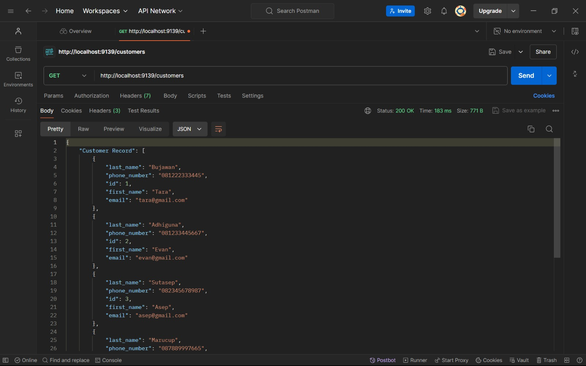

Mendapatkan record customer dengan ID customer adalah 2  
http://localhost:9139/customers/2
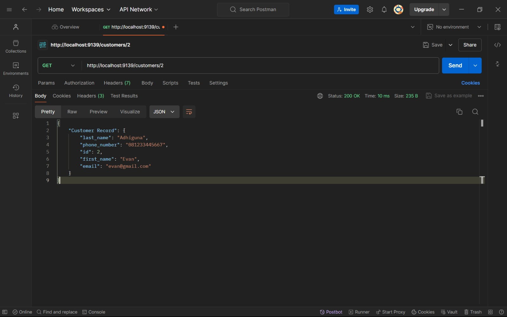

Mendapatkan record cards dengan ID Customer adalah  
http://localhost:9139/customers/2/cards
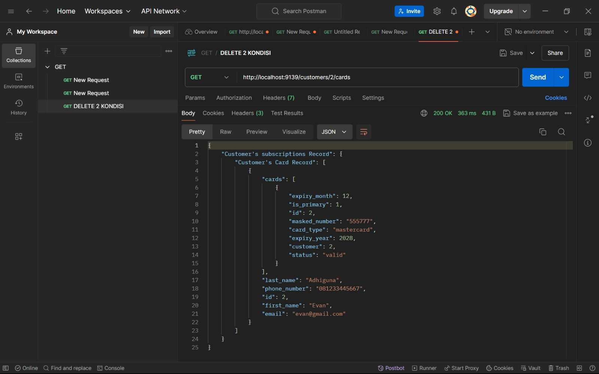

Mendapatkan record customer subscription record berdasarkan ID customer adalah 2  
http://localhost:9052/customers/2/subscriptions
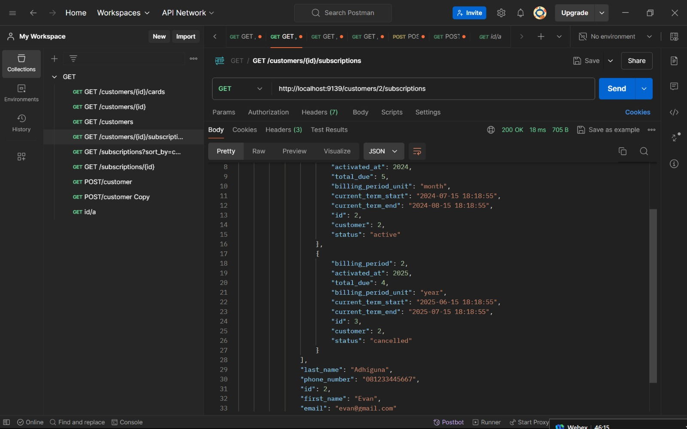

Mendapatkan seluruh record item  
http://localhost:9139/items
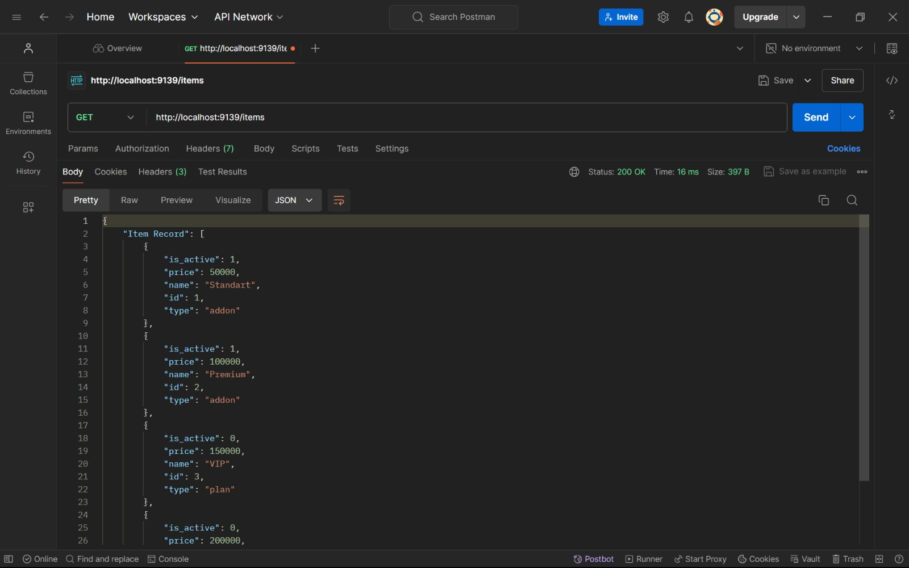

Mendapatkan record item dengan ID item adalah 1  
http://localhost:9139/items/1
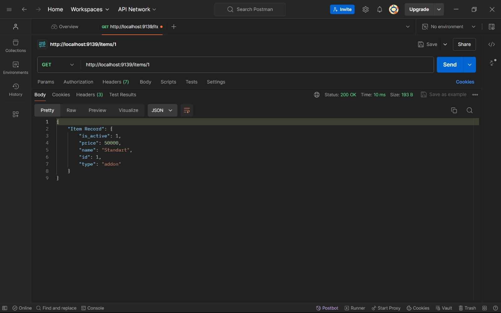

Mendapatkan record item dengan status active adalah true  
http://localhost:9139/items?is_active=true
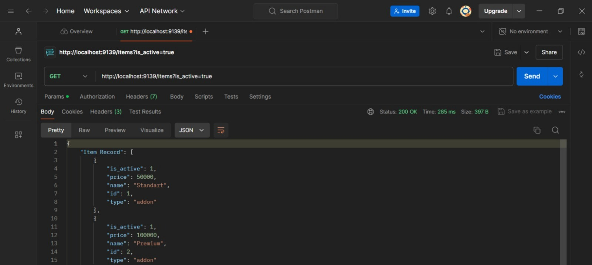

Mendapatkan record semua subscription  
http://localhost:9139/subscriptions
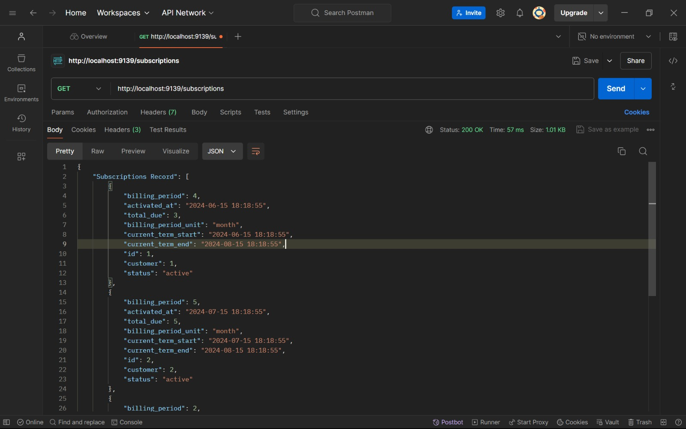

Mendapatkan record subscription dengan current term end descending  
http://localhost:9139/subscriptions?sort_by=current_term_end&sort_type=desc
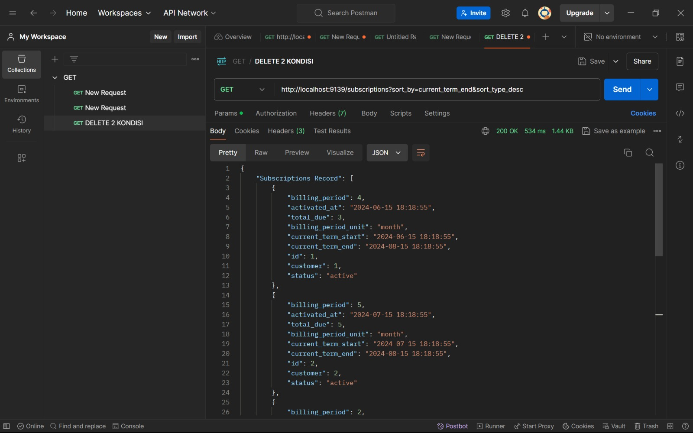

##
### POST
Menambahkan data baru pada Customers  
http://localhost:9139/customers
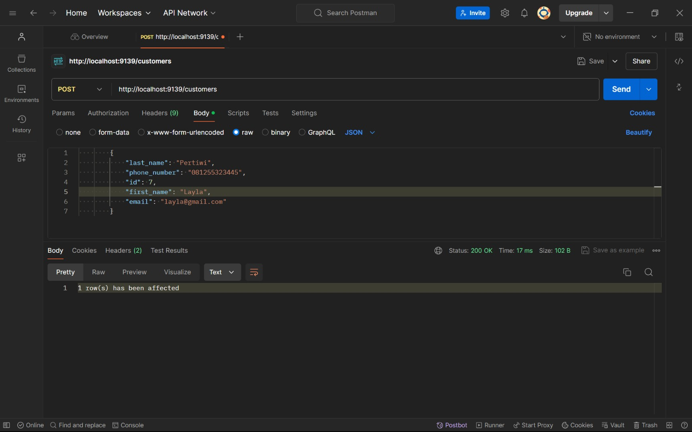

Menambahkan data baru pada Items  
http://localhost:9139/items

Menambahkan data baru pada Subscriptions  
http://localhost:9139/subscriptions
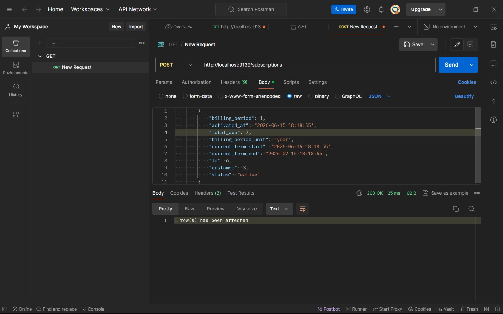
 

##
### PUT
Mengupdate data Customers  
http://localhost:9139/customers/7
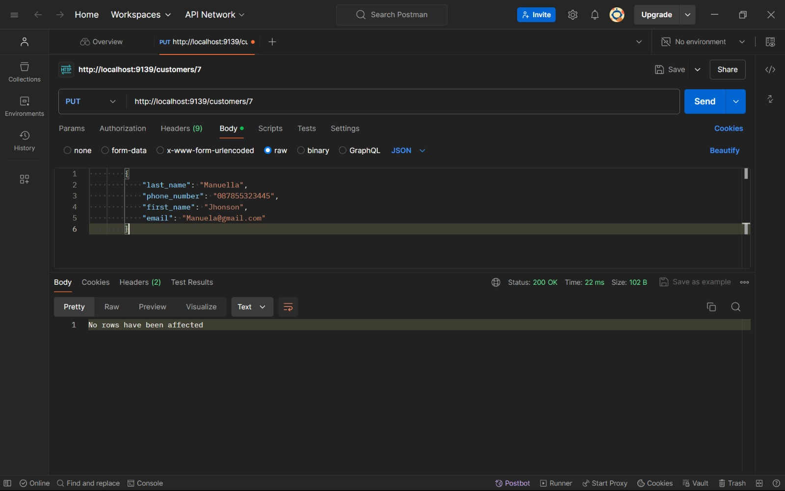

Mengupdate data Items  
http://localhost:9139/items/2

##
### DELETE
Menghapus atau mengubah status is_active menjadi false pada Items berdasarkan ID  
http://localhost:9139/items/2
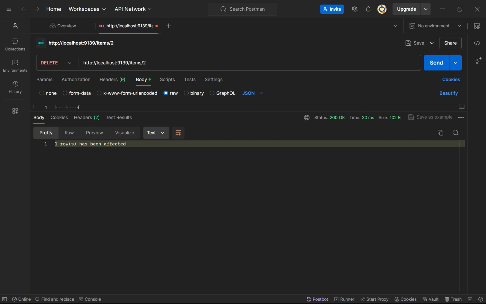

Menghapus informasi kartu kredit customer jika is_primary bernilai false  
http://localhost:9139/customer/5/cards/5
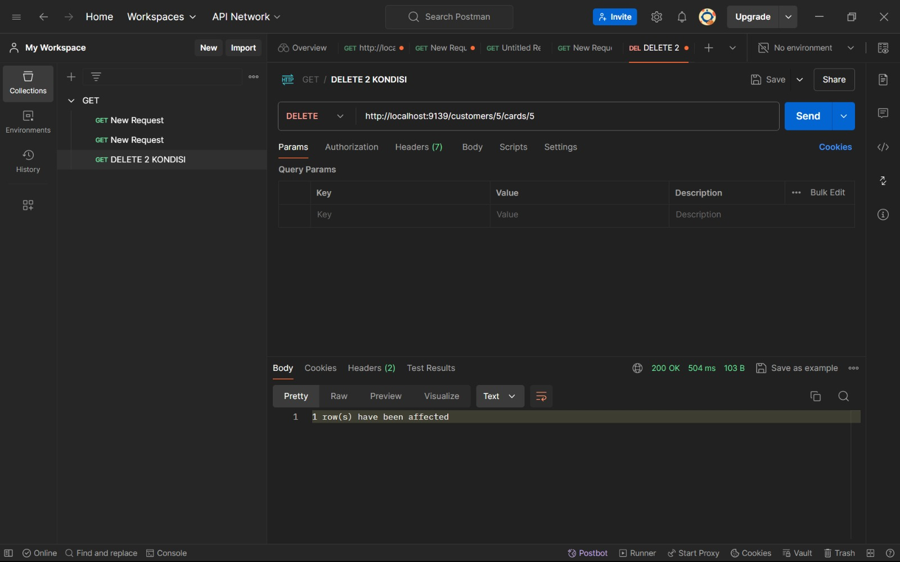

##
### ERROR 404
http://localhost:9139/roger/2 (Tidak ada entitas ROGER)
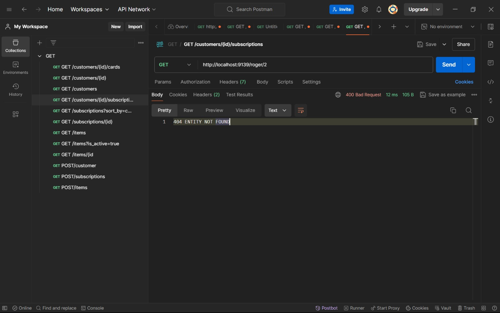

### ERROR 405
PATCH http://localhost:9139 (Di luar GET, POST, PUT, DELETE)
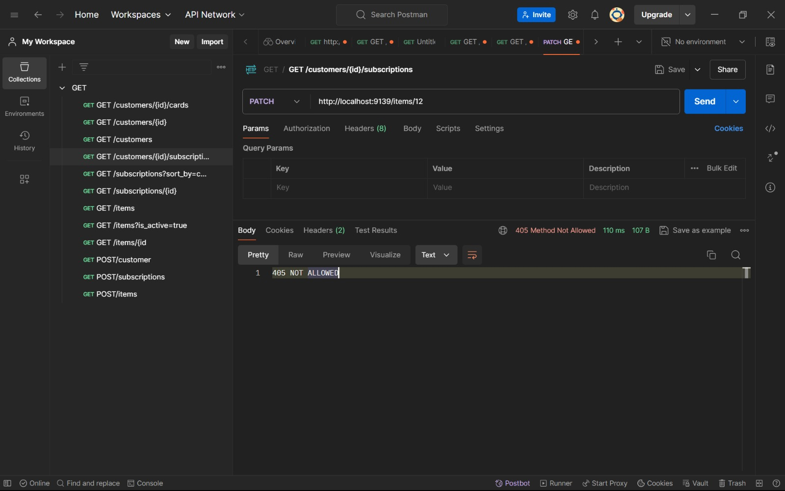
